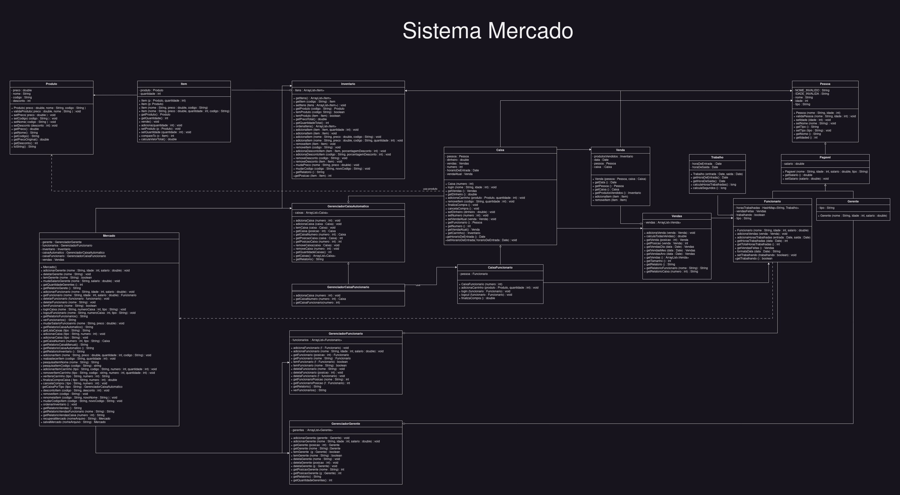

# Sistema de Gerenciamento de Mercado

Para uma explicação mais detalhada sobre cada classe desenvolvida no projeto, é possível acessar este [video](https://www.youtube.com/channel/UCgI_vch0Sek72UrqnwWjpBA)

- A funcionalidade de gerenciar o mercado
- A funcionalidade de se logar como atendente de um caixa
- A funcionalidade de utilizar um caixa automatico (sem a necessidade de um funcionario)

Quando logado como gerente, o usuario pode realizar diversas atividades, como gerenciar os funcionarios, os caixas automaticos e manuais, os gerentes, o inventário do mercado, além de poder gerar relatórios relacionados a todos esses aspectos, mostrando quantas vendas foram feitas, por quem foram feitas, as datas nas quais foram feitas, com vários dados relacionados a elas.

Porem, mesmo que esses exemplos sejam o que está sendo demonstrado na classe Main, é possível utiliza-los para que seja possível conseguir dados ainda mais especificos e gerar relatórios mais completos e complexos. Por exemplo, seria possível gerar um relatorio mostrando quais as desepesas mensais baseadas no reabastecimento do mercado, o salário e a média de rendimento diário, permitindo com que os gerentes conseguissem visualizar o saldo e despesas mensais e gerenciar essa questão.

O sistema foi feito para o projeto final da disciplina de Linguagem de Programação, do curso de sistemas de informação da UFPB.

## UML

